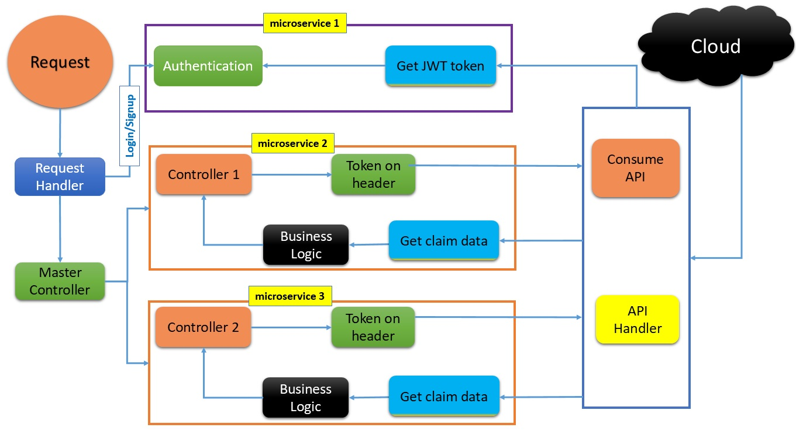
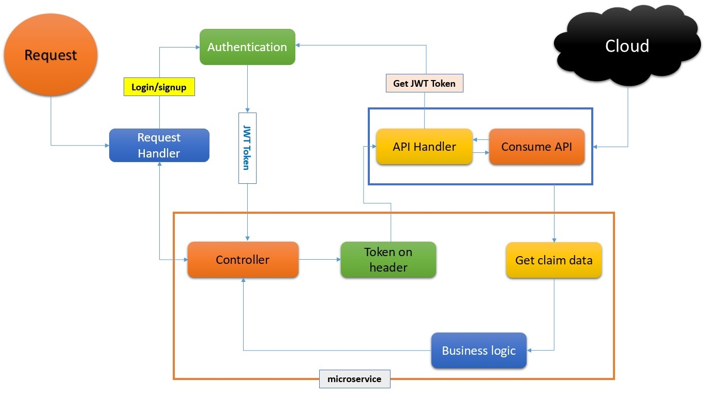
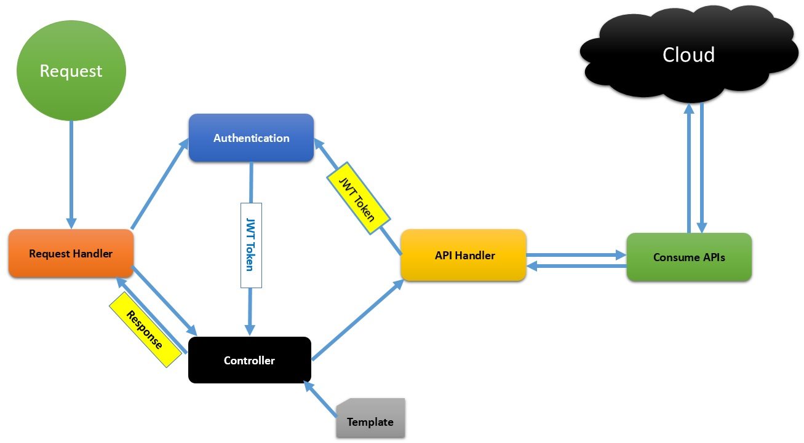

# Consume RESTful APIs 

Machine-To-Machine communication for multiple microservices using JWT authentication.

This app consumes RESTful APIs to collect JSON data, apply bussiness logic and response back. Machine to machine communication uses JWT token authentication & no any sessions needed.

# Built

App is built on core PHP 8.0.9, no data base and no any third party tools has been used.

# Microservices Architecture

# JWT work flow

# System Design

# Features

- [X] Microservices Architecture
- [X] Loose Coupling and High Cohesion
- [x] MVC Pattern
- [X] JWT Authentication
- [X] No Sessions
